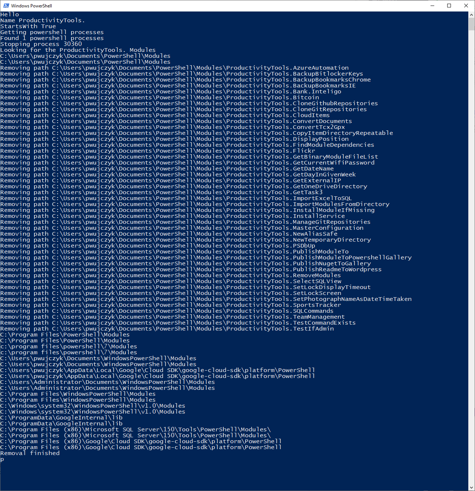

<!--Category:PowerShell--> 
 <p align="right">
    <a href="https://www.powershellgallery.com/packages/ProductivityTools.RemoveModules"></a>
    <a href="http://productivitytools.top/removemodules/"><a> 
    <a href="https://github.com/pwujczyk/ProductivityTools.RemoveModules"></a>
</p>
<p align="center">
    <a href="http://http://productivitytools.tech/">
        
    </a>
</p>

# Remove Modules

Module removes modules from system. 

<!--more-->

Module iterates through ``$env:PSModulePath`` directories and for each removes module with name provided or with the name which starts with provided string


```powershell
Remove-Modules -Name ProductivityTools.RemoveModules 
Remove-Modules -Name ProductivityTools. -StartsWith
```
First command will remove the ```ProductivityTools.RemoveModules``` module.

Second command will remove all modules which starts with ```ProductivityTools.```


Module during work will force close all powershell instances so removal should succeed.

Module also expose cmdlet:
```powershell
RemoveProductivityTools-Modules
```




